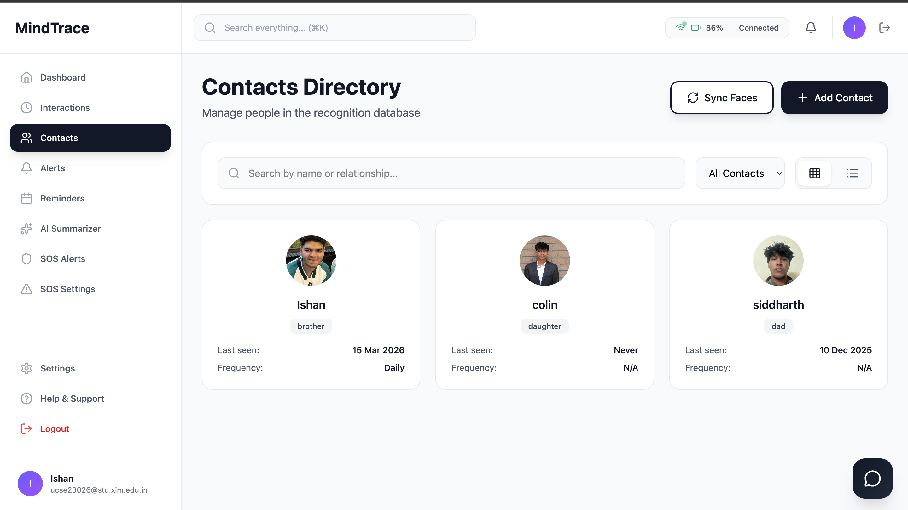
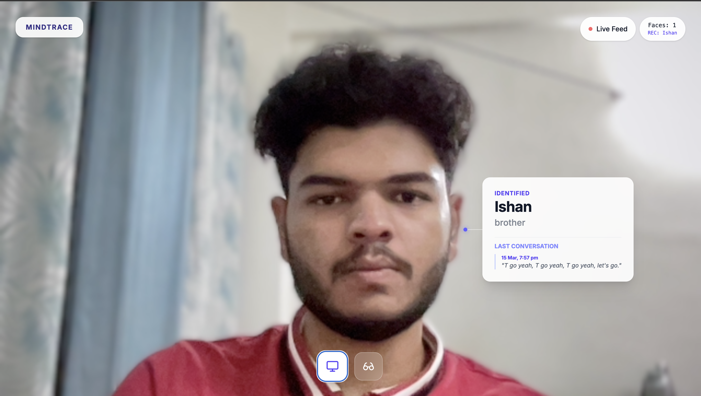
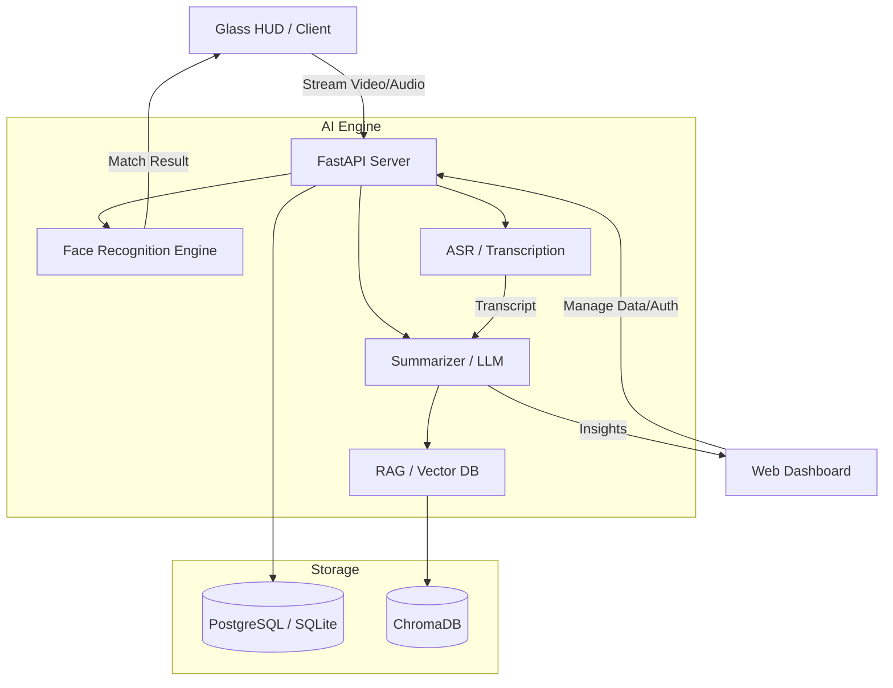

# 🧠 MindTrace

**Your Cognitive Companion — Digitizing Human Connection through Wearable AI.**

[](https://fastapi.tiangolo.com/)
[](https://reactjs.org/)
[](https://tailwindcss.com/)
[](https://deepmind.google/technologies/gemini/)
[](https://www.trychroma.com/)

---

## 🌟 Overview

**MindTrace** is an advanced "Second Brain" ecosystem designed to augment human memory and social interaction. By combining wearable-first interfaces with state-of-the-art AI, MindTrace helps you remember names, recall conversations, and never miss a beat in your social and professional life.

Whether it's real-time face recognition on a HUD (Heads-Up Display) or a comprehensive web dashboard for semantic memory retrieval, MindTrace is built for those who value precise information and meaningful connections.

---

## 📸 Visual Showcase

````carousel

<!-- slide -->

<!-- slide -->

<!-- slide -->

````

---

## 🏗️ Core Ecosystem

MindTrace is comprised of three primary pillars:

### 1. 🖥️ Web Dashboard (`/client`)
A sophisticated command center built with **React 19** and **Vite**. 
- Manage detailed contacts and relationship histories.
- Interactive **Recharts** dashboard for social activity metrics.
- AI-powered Interaction Summarizer.
- Secure SOS and custom alert configurations.

### 2. 🥽 Glass HUD (`/glass-client`)
A specialized interface optimized for wearable devices (like Meta Glass) or lightweight mobile browsers.
- **Low-latency Face Recognition** in the vicinity.
- **Ambient ASR** (Automatic Speech Recognition) for real-time transcription.
- Minimalist HUD overlays for identifying acquaintances instantly.

### 3. ⚙️ AI Engine & Backend (`/server`)
A high-performance **FastAPI** backend orchestrating complex ML workloads:
- **InsightFace**: Enterprise-grade facial analysis and recognition.
- **OpenAI Whisper**: High-accuracy ambient transcription.
- **RAG Engine**: Vector-based semantic search powered by **ChromaDB** and **Google Gemini**.
- **LangChain**: Complex LLM orchestration for memory summarization.

---

## 🚀 Key Features

- **👁️ Face Identity Service**: Identify family, friends, or coworkers instantly via facial embedding matching.
- **🎙️ Ambient Mind Tracking**: Records and transcribes interactions in the background, tagging them to specific contacts.
- **🧠 Semantic Memory Search**: Ask questions like *"When was the last time I met John and what did we discuss?"*
- **📅 Smart Reminders**: Automatically generated tasks based on conversation context (e.g., *"Remind me to buy the gift John mentioned"*).
- **🚨 Advanced SOS System**: Location-based emergency alerts with custom notification hooks.
- **📊 Social Insights**: Visualize your interaction frequency and relationship depth over time.

---

## 🛠️ Tech Stack

### Frontend
- **Framework**: React 19 (Vite)
- **Styling**: Tailwind CSS 4 (Vanilla CSS approach)
- **Animations**: Framer Motion
- **Smooth Scroll**: Lenis
- **Maps**: React Leaflet
- **Icons**: Lucide React
- **Notifications**: React Hot Toast
- **Routing**: React Router 7

### Backend
- **Framework**: FastAPI (Python 3.12+)
- **ORM**: SQLAlchemy
- **Task Scheduling**: Custom Python Scheduler
- **Authentication**: JWT (python-jose, bcrypt)

### AI & ML Architecture
- **Inference**: ONNX Runtime, PyTorch
- **Computer Vision**: OpenCV, InsightFace
- **Speech**: Faster Whisper / OpenAI Whisper
- **LLM**: Google Gemini (Gemini 1.5 Pro/Flash)
- **Vector DB**: ChromaDB
- **Orchestration**: LangChain

---

## 🧠 Deep Dive: AI Models

For a detailed technical breakdown of how we use each model, their implementation details, and the rationale behind choosing them, please refer to the **[AI Models Documentation](MODELS.md)**.

---

## 📐 Architecture


```mermaid
graph TD
    A[Glass HUD / Client] -->|Stream Video/Audio| B[FastAPI Server]
    C[Web Dashboard] -->|Manage Data/Auth| B
    
    subgraph AI Engine
        B --> D[Face Recognition Engine]
        B --> E[ASR / Transcription]
        B --> F[Summarizer / LLM]
        F --> G[RAG / Vector DB]
    end
    
    subgraph Storage
        B --> H[(PostgreSQL / SQLite)]
        G --> I[(ChromaDB)]
    end
    
    D -->|Match Result| A
    E -->|Transcript| F
    F -->|Insights| C
```

---

## 🏁 Getting Started

### Prerequisites
- Node.js 18+
- Python 3.10-3.12
- [uv](https://docs.astral.sh/uv/) (Recommended Python manager)
- Google Gemini API Key

### Quick Setup

1. **Clone & Install**
   ```bash
   git clone https://github.com/yourusername/mindtrace.git
   cd mindtrace
   ```

2. **Backend Setup**
   ```bash
   cd server
   uv sync
   cp .env.example .env # Add your GEMINI_API_KEY
   uv run main.py
   ```

3. **Frontend Setup**
   ```bash
   cd client
   npm install
   npm run dev
   ```

4. **Glass Client (Optional)**
   ```bash
   cd glass-client
   npm install
   npm run dev
   ```

---

## 📂 Directory Structure

```text
MindTrace/
├── client/             # Main Web Dashboard (React + Vite)
├── glass-client/       # Wearable HUD Interface
├── server/
│   ├── app/            # FastAPI Routes & Logic
│   ├── ai_engine/      # ML Models (FaceID, ASR, RAG)
│   ├── data/           # Local storage & DBs
│   └── main.py         # Entry point
├── screenshots/        # Project visuals
├── QUICKSTART.md       # 10-minute setup guide
├── API.md              # Endpoint documentation
└── CONTRIBUTING.md     # How to help
```

---

## 📜 License

Distributed under the MIT License. See `LICENSE` for more information.

---

<p align="center">
  Built with ❤️ for people who need a little help remembering.
</p>
